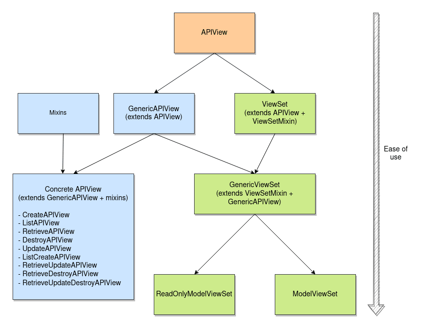

# Class Based Views

- Lets see our models.py and serializers.py first:

```python
# models.py
from django.db import models

class Path(models.Model):
    path_name = models.CharField(max_length=50)

    def __str__(self):
        return f"{self.path_name}"

class Student(models.Model):
    path = models.ForeignKey(Path, related_name='students', on_delete=models.CASCADE)
    first_name = models.CharField(max_length=30)
    last_name = models.CharField(max_length=30)
    number = models.IntegerField(blank=True, null=True)

    def __str__(self):
        return f"{self.last_name} {self.first_name}"
```

```python
# serializers.py
from rest_framework import serializers
from .models import Student,Path
    
class StudentSerializer(serializers.ModelSerializer):
    path=serializers.StringRelatedField()
    path_id=serializers.IntegerField()

    class Meta:
        model = Student
        fields = ["id","path_id","path","first_name", "last_name", "number"]

class PathSerializer(serializers.ModelSerializer):
    students = StudentSerializer(many=True)

    class Meta:
        model = Path
        fields = ["id", "path_name", 'students']
```

- For CBV, there are several ways to define a view. Below we'll be seeing 4 different ways, mostly from the most verbose to the least verbose.

<!--  -->
<p align="center">
  
</p>

## APIView

- Let's start with the most verbose one, `APIView`. The list `GET` and `POST` method:

```python
# views.py
from rest_framework.views import APIView
from rest_framework.response import Response
from rest_framework import status

class StudentList(APIView): # because now we're using the CBV's, we have to inherit from APIView

    def get(self, request): # we just have to define a get (and post below) to define those mehtods in CBV
        students = Student.objects.all()
        serializer = StudentSerializer(students, many=True) # many=True since we'll probbaly get more than one student returned
        return Response(serializer.data)

    def post(self, request):
        serializer = StudentSerializer(data=request.data) # here, it is different than the get method. We pass the "data=request.data"
        if serializer.is_valid(): # since this is a POST request we have to check if the form is valid
            serializer.save()
            return Response(serializer.data, status=status.HTTP_201_CREATED)

        return Response(serializer.errors, status=status.HTTP_400_BAD_REQUEST)

# urls.py
from django.urls import path, include
from .views import (
    StudentList,
)

urlpatterns = [
    path('student/', StudentList.as_view()),
]
```

- The detail `GET`, `PUT`, and `DELETE` method:

```python
# views.py
class StudentDetail(APIView):

    def get_obj(self, pk): # as per coding DRY standarts, we're defining a get_obj function later to use it in get, put, and delete functions
        return get_object_or_404(Student, pk=pk)

    def get(self, request, pk):
        student = self.get_obj(pk)
        serializer = StudentSerializer(student)
        return Response(serializer.data)

    def put(self, request, pk):
        student = self.get_obj(pk)
        serializer = StudentSerializer(student, data=request.data) # here, it is different than the get method. We pass the "data=request.data" too
        if serializer.is_valid():
            serializer.save()
            new_data = serializer.data
            new_data['success'] = f"student {student.last_name} updated successfully" # adding a new "success" key later to return in Response
            return Response(new_data)
        return Response(serializer.errors, status=status.HTTP_400_BAD_REQUEST)
    
    def delete(self, request, pk):
        student = self.get_obj(pk)
        student.delete()
        data = {
            "message": f"Student {student.last_name} deleted successfully" # adding a new dictionary data with a key "message" later to return in Response
        }
        return Response(data, status=status.HTTP_204_NO_CONTENT)

# urls.py
urlpatterns = [
    ...
    path('student/<int:pk>', StudentDetail.as_view()),
]
```

## GenericAPIView

- GenericAPIView actually extends from the `APIView`. You can see that by looking into the source code for GenericAPIView
- The listing `GET` and `POST` methods in GenericAPIView:

```python
# views.py
from rest_framework.generics import GenericAPIView, mixins

class StudentListCreate(mixins.ListModelMixin, mixins.CreateModelMixin, GenericAPIView):
    queryset = Student.objects.all()
    serializer_class = StudentSerializer

    def get(self, request, *args, **kwargs):
        return self.list(request, *args, **kwargs) # the list() method inherits from the ListModelMixin

    def post(self, request, *args, **kwargs):
        return self.create(request, *args, **kwargs) # the create() method inherits from the CreateModelMixin

# the mixin inheritences must come to the left of the GenericAPIView inheritence. 
# the respective mixins for listing get and post are ListModelMixin and CreateModelMixin
# Compared to APIView, notice with how much less code we wrote our GET and POST method.
# The queryset and serializer_class are actually reserved words here. Notice how we didn't even use them in the get and post functions. We 
# have to define them to let our GenericAPIView know what our queryset and serializer_class are. Want to see more about them? Check the 
# source code for GenericAPIView and the respective mixins how queryset and serializer_class are utilised

# urls.py
urlpatterns = [
    ...
    path('student/', StudentListCreate.as_view()),
]
```

- The detail `GET`, `PUT`, and `DELETE` methods

```python
# views.py
class StudentURD(mixins.RetrieveModelMixin, mixins.UpdateModelMixin, mixins.DestroyModelMixin, GenericAPIView):
    queryset = Student.objects.all()
    serializer_class = StudentSerializer

    def get(self, request, *args, **kwargs):
        return self.retrieve(request, *args, **kwargs) # the retrieve() inherits from the RetrieveModelMixin

    def put(self, request, *args, **kwargs):
        return self.update(request, *args, **kwargs) # the update() method inherits from the UpdateModelMixin

    def delete(self, request, *args, **kwargs):
        return self.destroy(request, *args, **kwargs) # the destroy() method inherits from the DestroyModelMixin

# the respective mixins for detail get, put, and delete are RetrieveModelMixin, UpdateModelMixin and DestroyModelMixin

# urls.py
urlpatterns = [
    ...
    path('student/<int:pk>', StudentURD.as_view()),
]
```

## Concrete APIView

- Concrete APIView is actually the amalgamation of the GenericAPIView and mixins.

```python
# views.py
from rest_framework.generics import ListCreateAPIView, RetrieveUpdateDestroyAPIView

# the listing GET and POST method:
class StudentLC(ListCreateAPIView): # ListCreateAPIView is used for the listing GET and POST method
    queryset = Student.objects.all()
    serializer_class = StudentSerializer # so, these two lines are all we need to get going. That's what makes concrete CBV awesome

# the detail GET, PUT and DELETE method:
class StudentRUD(RetrieveUpdateDestroyAPIView): # RetrieveUpdateDestroyAPIView is used for the detail GET, PUT, and DELETE method
    queryset = Student.objects.all()
    serializer_class = StudentSerializer

# Amazing right? with only two lines we have defined our classes

# urls.py
urlpatterns = [
    ...
    path('student/', StudentLC.as_view()), 
    path('student/<int:pk>', StudentRUD.as_view()),
]
```

## ViewSet

- ViewSet is actually the amalgamation of the APIViews and ViewSetMixin.

```python
# views.py
from rest_framework.viewsets import ModelViewSet

class StudentCRUD(ModelViewSet):
    queryset = Student.objects.all()
    serializer_class = StudentSerializer

# ViewtSet is even shorter than the Concrete APIView since it lets you do everything in one class. But, it is a bit tricky to set a url
# in urls.py. Let's see why that is
```

- Like said in the note above, the urls.py part for the ViewSet model views are a bit tricky. We have two options. First one:

```python
# urls.py
user_list = StudentCRUD.as_view({'get': 'list'})
user_detail = StudentCRUD.as_view({'get': 'retrieve'})

urlpatterns = [
    ...
    path('student/', user_list.as_view()), # this would only get the listing GET method
    path('student/<int:pk>', user_detail.as_view()), # this would only get the retreiving GET method
]

# This method of defining the url is actually not preferred
```

- The official docs [say](https://www.django-rest-framework.org/api-guide/viewsets/#example), "Typically we wouldn't do this, but would instead register the viewset with a router, and allow the urlconf to be automatically generated.". Thus, the second method:

```python
# urls.py
from django.urls import path, include
from .views import StudentCRUD
from rest_framework.routers import DefaultRouter

router = DefaultRouter()
router.register('student', StudentCRUD)

urlpatterns = [
    ...
    path('', include(router.urls))
]

# the urls.py, therefore, is a bit different with all that DefaultRouter router.register. But the good thing about this is that, with only one 
# line in urlpatterns, we didn't have to add an endpoint like <int:pk>, because router handles that for us. To see how that happens, read the 
# source code for router.
```

- Talking about the ViewSet, we can also specify the `@action` decorator: "If you have ad-hoc methods that should be routable, you can mark them as such with the `@action` decorator." See the official [docs](https://www.django-rest-framework.org/api-guide/viewsets/#marking-extra-actions-for-routing) for more. For our last ViewSet StudentCRUD, let's define an `action` and see how it could be utilised:

```python
# urls.py
class StudentCRUD(ModelViewSet):
    queryset = Student.objects.all()
    serializer_class = StudentSerializer

    @action(detail=False, methods=['GET'])
    def student_count(self,request):
        count={
            'student-count': self.queryset.count()
        }
        return Response(count)

# the code must be self-explanatory but this will return the total number of students. Say our url is defined the way it is on the above code
# snippet with the endpoint of "student". How we'd access the student_count function with that url is as follows: "student/student_count/"
# some notes on the arguments action decorator takes: 
# if not provided, methods defaults to GET. Meaning, we could have left it empty and still get the same result on the endpoint but
# the detail argument is required. It determines whether this action applies to instance/detail requests or collection/list requests.
```