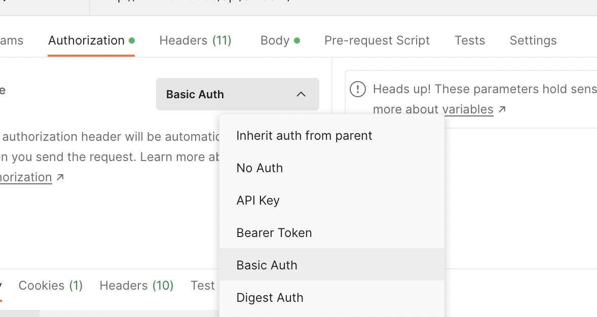
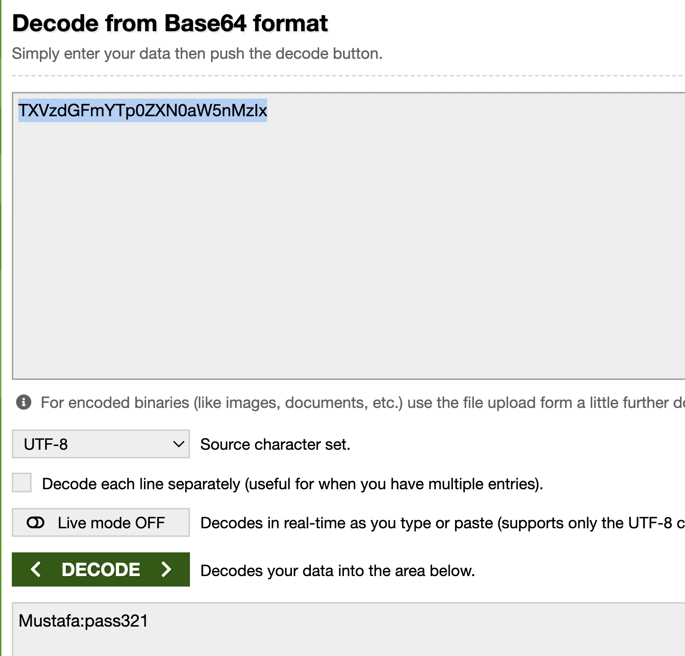
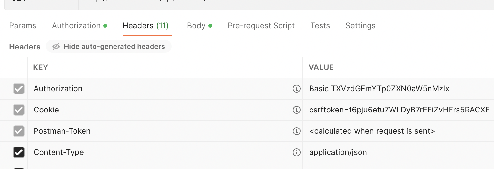
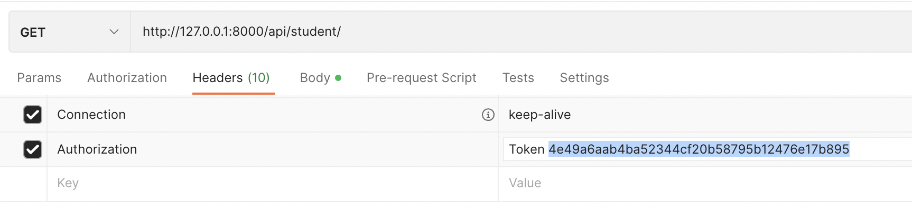
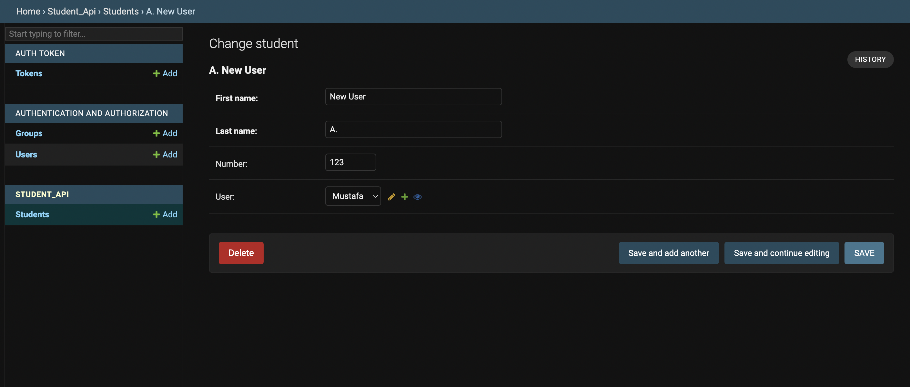

# DRF-Auth-Permissions

- Permissions determine whether a request should be granted or denied access. There are layers into how you can define permissions. You can define it on settings and get global permissions apply, or you can set permissions on certain views specifically. Better yet, you can define permissions only for certain objects; say, for a student.
- Authorization checks who sends this request.
- You get some some built-in permission policies like; **[AllowAny](https://www.django-rest-framework.org/api-guide/permissions/#allowany)** (this is the default)**, [IsAuthenticated](https://www.django-rest-framework.org/api-guide/permissions/#isauthenticated), [IsAdminUser](https://www.django-rest-framework.org/api-guide/permissions/#isadminuser),** and **[IsAuthenticatedOrReadOnly](https://www.django-rest-framework.org/api-guide/permissions/#isauthenticatedorreadonly)**
- The built-in authorization policies are as follows: **[BasicAuthentication](https://www.django-rest-framework.org/api-guide/authentication/#basicauthentication)** (not so secure), **[TokenAuthentication](https://www.django-rest-framework.org/api-guide/authentication/#tokenauthentication), [SessionAuthentication](https://www.django-rest-framework.org/api-guide/authentication/#sessionauthentication), [RemoteUserAuthentication](https://www.django-rest-framework.org/api-guide/authentication/#remoteuserauthentication)**

<aside>
💡 Best practice for setting permission policy is to use your views; therefore, setting them locally. But, for authorization mostly global settings should be preferred.

</aside>

## Authorization

- Let’s set a basic authorization globally:

```python
# settings.py
REST_FRAMEWORK = {
    'DEFAULT_AUTHENTICATION_CLASSES': [
        'rest_framework.authentication.BasicAuthentication',
    ]
}
```

- Say we have a StudentList view and the corresponding endpoint for that view is /api/student/ and we want to add `IsAuthenticated` permission, we'd do that as following:

```python
# views.py
from rest_framework.permissions import IsAuthenticated

class StudentList(generics.ListCreateAPIView):
    serializer_class = StudentSerializer
    queryset = Student.objects.all()
    permission_classes = [IsAuthenticated] # "permission_classes" is what we use for permissions
```

- Before adding the above codes into my project, I'd get the students listed when I used the /api/student/ endpoint. But after adding them, I'll get the following error:

```python
{
    "detail": "Authentication credentials were not provided."
}
```


- Because we set our BasicAuth globally, we have to provide what BasicAuth needs to be able to have a valid GET request. And BasicAuth requires one to send the username and password of the user to authorize (which is why BasicAuth is not very secure). Therefore, in Postman in the Authorization tab select Basic Auth and enter your username and password for which you have created with createsuperuser. Only after entering your username and password there, will you be able to see the student list when you send a GET request, or be able to do a POST request for that matter.

<!--  -->
<p align="center">
  
</p>

- And if we were to use `IsAdminUser` for our views permission setting, as the name suggest, you'll not only be sending your username and password but also you'll have to be admin. Therefore, for the views like below;

```python
# views.py
from rest_framework.permissions import IsAdminUser

class StudentList(generics.ListCreateAPIView):
    serializer_class = StudentSerializer
    queryset = Student.objects.all()
    permission_classes = [IsAdminUser] # notice now we changed it to IsAdminUser
```

- For the views we have above, if we were to send a username and password for a user who's not admin we'd get an permission error like the one below;

```python
{
    "detail": "You do not have permission to perform this action."
}
```

- And now let's try `IsAuthenticatedOrReadOnly`;

```python
# views.py
from rest_framework.permissions import IsAdmIsAuthenticatedOrReadOnlyinUser

class StudentList(generics.ListCreateAPIView):
    serializer_class = StudentSerializer
    queryset = Student.objects.all()
    permission_classes = [IsAuthenticatedOrReadOnly] # notice now we changed it to IsAuthenticatedOrReadOnly
```

- For the view function above, we'll be able to see our student list for our GET requests even if we are not logged in. However, it would not be possible to perform a POST request before getting authorized by providing with username and password. The following would be the error for trying to do a POST request without authorization;

```python
{
    "detail": "Authentication credentials were not provided."
}
```


- We have stated earlier that BasicAuth is not secure. Let's see why. Head over to your Header tab in Postman and see the Authorization key-value pair. And in the value part after the String "Basic " comes an encoded string, paste that into a base64 decoder in internet and you'll get your username and password returned in username:password format.

<!-- 

 -->

<p align="center">
  
  
</p>


- Having seen how detrimental using BasicAuth might be, let's now see the more secure way of dealing with Authorization: **[TokenAuthentication](https://www.django-rest-framework.org/api-guide/authentication/#tokenauthentication)**;

```python
# settings.py
INSTALLED_APPS = [
    ...
    'rest_framework.authtoken'
]

# First things first, we'll need to add 'rest_framework.authtoken' to our INSTALLED_APPS
# Also you might need to apply migrations with python manage.py migrate after this
```

- Also, change your REST_FRAMEWORK settings to be the following;

```python
REST_FRAMEWORK = {
    'DEFAULT_AUTHENTICATION_CLASSES': [
        'rest_framework.authentication.TokenAuthentication',
    ]
}
```

- Now that we have added TokenAuthentication, we'll see a new tab `Tokens` in our Admin panel from which we can generate tokens for users. For the sake of simplicity, let's change our views' permission to `IsAuthenticated`;

```python
# views.py
class StudentList(generics.ListCreateAPIView):
    serializer_class = StudentSerializer
    queryset = Student.objects.all()
    permission_classes = [IsAuthenticated]
```


- Now head back to Postman and change the auth type in Tab in `Authorization` to "`No Auth`" (which was previously "`Basic Auth`"). And add a new key-value pair in `Headers` tab. Set "`Authorization`" as key and "`Token <yourTokenHere>`" as value. You can get your token key from the Admin Panel by creating one for each user. After you have ticked the key-value pair row you have added, you'll be able to do GET request. And now go ahead and unselect that key-value pair and you'll get an "Authentication credentials were not provided.” error.
<!--  -->

<p align="center">
  
</p>

- It's all good, but this is feasible only with Postman and Admin Panel and is therefore is not practical since we want to automize the process. There are some ways to go about it. You can see some ways like using signals or using the `obtain_auth_token` in drf official [docs](https://www.django-rest-framework.org/api-guide/authentication/#tokenauthentication).
- Let's see how `obtain_auth_token` works. For that, let's first create a new app called user_api for login and register instances;

```python
python manage.py startapp user_api

# don't forget to add 'user_api' to INSTALLED_APPS in settings.py
```

- In the project's urls.py add the following;

```python
from django.urls import path, include

urlpatterns = [
    ...
    path('user/', include('user_api.urls')),
]
```

- And in the user_api urls.py add the following;

```python
from django.urls import path
from rest_framework.authtoken.views import obtain_auth_token

urlpatterns = [
    path('login/', obtain_auth_token, name="login"),
]

# in a nutshell, obtain_auth_token expects a username and password (as we'll see it 
# in practice below) and sends the token associated with that user as a result
```

- Now let's head to Postman and untick the Authorization we have added previously. And in the Body tab select row and add your username and password in a JSON format and send a POST request to the endpoint user/login/

```python
# therefore POSTing this;
{
    "username": "Mustafa", # your username and password should match
    "password": "pass321"
}

# we will get this;
{
    "token": "4e49a6aab4ba52hsd63f20b58795b12jhgqd72395"
}

# In Front-End terms what we did here is simply trying to log in with a username and password. And upon entering
# a valid username and password we recieved the token we will be using to validate that the user
```

- The token we received is the same token we have used previously, which we were able to get from Admin Panel. The only difference is now we can receive the token from Front-End too. And now try to send GET and POST requests in the endpoint api/student/ after adding the token to Headers, you'll be able to successfully send GET and POST requests. Therefore, what a Front-End does in this process is they add the token to Headers in their, say, axios method and be able to have the user logged in as long as the token in not missing in their request JSON.
- This was the login process only, if we wanted to register the user from the front-end, we probably will need a different endpoint. Since registration requires a validation check, we need to add a serializer;

```python
# serializers.py
from rest_framework import serializers
from django.contrib.auth.models import User
from rest_framework.validators import UniqueValidator
from django.contrib.auth.password_validation import validate_password

class RegistrationSerializer(serializers.ModelSerializer):
    # since email field set to blank=True and doesn't validate for uniqueness in source code (User/AbstractUser Model) we're defining it again.
    # for UniqueValidator see: https://www.django-rest-framework.org/api-guide/validators/#uniquevalidator
    email = serializers.EmailField(
            required=True,
            validators=[UniqueValidator(queryset=User.objects.all())] # therefore, this makes sure our emails are unique
            )

    password = serializers.CharField(
        write_only=True,
        required=True,
        validators=[validate_password], # validators validates the password for the required standarts
        style={"input_type": "password"} # this one is not required but adding this will have this field appear as 'passwrod' on browser api 

    )

    password2 = serializers.CharField(
        write_only=True,
        required=True,
        validators=[validate_password],
        style={"input_type": "password"}
    )

    class Meta:
        model = User
        fields = ('username', 'password', 'password2', 'email', 'first_name', 'last_name')
        extra_kwargs = {
            'first_name': {'required': True},
            'last_name': {'required': True}
        }

    def validate(self, attrs): # validating if password and password2 match
        if attrs['password'] != attrs['password2']:
            raise serializers.ValidationError({"password": "Password fields didn't match."})

        return attrs

    def create(self, validated_data): # we are creating a user but we do not want to include password as is; hence, we do not include it in user
        user = User.objects.create(
            username=validated_data['username'],
            email=validated_data['email'],
            first_name=validated_data['first_name'],
            last_name=validated_data['last_name']
        )

        
        user.set_password(validated_data['password']) # therefore, we are creating the password with set_password() to send the hashed form and not the string form
        user.save()

        return user

    #! Second way of defining the create() method (it does the same thing):
    # def create(self, validated_data):
    #    password = validated_data.pop("password")
    #    validated_data.pop('password2')
    #    user = User.objects.create(**validated_data)
    #    user.set_password(password)
    #    user.save()
    #    return user

# now this serializer might look wordy, but it is what it is. Besides, you'll probably just copy 
# and paste this serializer whenever you need a registration serializer
```

```python
# views.py
from django.shortcuts import render
from .serializers import RegistrationSerializer
from rest_framework import generics
from django.contrib.auth.models import User

class RegisterView(generics.CreateAPIView):
    queryset = User.objects.all()
    serializer_class = RegistrationSerializer
```

- Having added our serizlizers and views, now let's add the view to our urls;

```python
# urls.py
from django.urls import path
from rest_framework.authtoken.views import obtain_auth_token
from .views import RegisterView

urlpatterns = [
    path('login/', obtain_auth_token, name="login"),
    path('register/', RegisterView.as_view(), name='register'),
]
```

- Now let's get back to Postman and test the endpoint user/register/. Choose the POST method and in the Body tab in row, this time send the fields we have had required in our serializer;

```python
{
    "username": "TestUser",
    "password": "pass321",
    "password2" : "pass321",
    "email" : "test@test.com",
    "first_name" : "Test",
    "last_name" : "User"
}

# after POSTing this, in your Admin Panel check the user TestUser being added
```

- But, by default, after adding the user TestUser we only get the following data being sent;

```python
{
    "username": "TestUser",
    "email": "test@test.com",
    "first_name": "Test",
    "last_name": "User"
}

# Only after we get to login page will we get the token. Hence, if we want to get token on registration
# page too, we have to add some more lines into our views, overriding the create method
```


- Before moving on with overriding our views, do remember that our user still can have access to their token by logging in after having registered. However, since we want to have access to our token even immediately after registration we are overriding the views.py. So here goes our new views.py;

```python
# views.py
from django.shortcuts import render
from .serializers import RegistrationSerializer
from rest_framework import generics
from django.contrib.auth.models import User
from rest_framework.response import Response
from rest_framework import status
from rest_framework.authtoken.models import Token

class RegisterView(generics.CreateAPIView):
    queryset = User.objects.all()
    serializer_class = RegistrationSerializer
    
    def create(self, request, *args, **kwargs):
        serializer = self.get_serializer(data=request.data)
        serializer.is_valid(raise_exception=True)
        user = serializer.save()
        token = Token.objects.create(user=user) # creating a token for a particular user
        data = serializer.data # serializer.data is normally what we have returned
        data['token'] = token.key # adding token to the returned data
        headers = self.get_success_headers(serializer.data)
        return Response(data, status=status.HTTP_201_CREATED, headers=headers)

# The create function defined here is mostly copied from CreateModelMixin, the mixin used for CreateAPIView.
# However, there has been some modifications with the create function in order to send the token too
```

- Let's test if the added create method in our views have made a difference when we register a new user. Again, we are using Postman's Body/raw part to do a POST request but remember that this is no different than registering a user in our front-end. Anyways, after sending a POST request with the following JSON;

```python
{
    "username": "TestUser2",
    "password": "pass321",
    "password2" : "pass321",
    "email" : "test@test2.com",
    "first_name" : "Test",
    "last_name" : "User"
}
```

- We *now* get this;

```python
{
    "username": "TestUser2",
    "email": "test@test2.com",
    "first_name": "Test",
    "last_name": "User"
    "token": "f96ea783030406332bb2aebe946ab37cac1c4914"
}

# It has worked! Now we get access to the token after register POST request
```
- Alternatively, we can add a signal watching a user to be created and if created, adding a token to the user;

```python
# signals.py
from django.contrib.auth.models import User
from django.db.models.signals import post_save
from django.dispatch import receiver
from rest_framework.authtoken.models import Token

@receiver(post_save, sender=User)
def create_auth_token(sender, instance=None, created=False, **kwargs):
    if created:
        Token.objects.create(user=instance)

# since we created our token in our signals, we no longer have to 
# 'create' it on our views, we just have to 'get' it like;
```

```python
# views.py
class RegisterView(generics.CreateAPIView):
    queryset = User.objects.all()
    serializer_class = RegistrationSerializer
    
    def create(self, request, *args, **kwargs):
        serializer = self.get_serializer(data=request.data)
        serializer.is_valid(raise_exception=True)
        user = serializer.save()
        token = Token.objects.get(user=user) # this is the only change. changed create to get
        data = serializer.data
        data['token'] = token.key
        data['message'] = 'user was created successfully' # we can generate as much key-values as we want. we'll now see the message in the response JSON too
        headers = self.get_success_headers(serializer.data)
        return Response(data, status=status.HTTP_201_CREATED, headers=headers)
```

- Finally, you might wanna add your signals import to your apps.py since that's what Django [recommends](https://docs.djangoproject.com/en/4.1/topics/signals/) doing;

```python
# apps.py
from django.apps import AppConfig

class UsersConfig(AppConfig):
    default_auto_field = 'django.db.models.BigAutoField'
    name = 'users'

    def ready(self):
        import users.signals

# assume that our app name is users 
```

- After generating our token with post_save signals and getting it in our create method in our views, we'll still get our token after registration;

```python
{
    "username": "TestUser3",
    "email": "test@test3.com",
    "first_name": "Test",
    "last_name": "User"
    "token": "f96ea783030406wjkbfbb2aebe946ab37cac1c4914"
    "message": "user was created successfully"
}

# see, we're still getting our token after registration
```

- It's all good with our Front-End having access to the user token after registration. Next, let's look into our default return JSON of our login requests;

```python
{
    "token": "2e49a6aab4bawjhef3y2876238795b12476e17b895"
}
```

- Therefore, only token is being sent by the default `obtain_auth_token` url settings. Hence, we have to inherit `[ObtainAuthToken](https://github.com/encode/django-rest-framework/blob/master/rest_framework/authtoken/views.py)` and override its post method and use that view in our views instead. Like so;

```python
# views.py 
from rest_framework.authtoken.views import ObtainAuthToken

class LoginView(ObtainAuthToken):

    def post(self, request, *args, **kwargs):
        serializer = self.get_serializer(data=request.data)
        serializer.is_valid(raise_exception=True)
        user = serializer.validated_data['user']
        token, created = Token.objects.get_or_create(user=user)
        return Response({'token': token.key, 'username': user.username})

# in the response part, it was originally returning the token only, we have
# added username too so as to have access to username after login.
```

- Let's add the new view to our urls.py;

```python
# views.py
from .views import LoginView

urlpatterns = [
    # path('login/', obtain_auth_token, name="login"), # we have to comment this since we overrode it and use the following instead;
    path('login/', LoginView.as_view(), name="login"),
]
```

- After logging in, now we will get the following JSON returned;

```python
{
    "token": "2e49a6aab4bawjhef3y2876238795b12476e17b895",
    "username": "Mustafa"
}

# remember, we were only getting the token returned, we now
# have access to the username too. Front-end is happy!
```

- If you're using dj-rest-auth as your Authentication package, overriding the login return value is a bit different. See [here](dj-rest-auto to be added)

- Finally let's add a logout view, where we want our token to be deleted;

```python
# views.py
@api_view(['POST'])
def logout_view(request):
    if request.method == 'POST':
        request.user.auth_token.delete()
        data = {
            'message': 'logout'
        }
        return Response(data)
```

```python
# urls.py
from django.urls import path
from .views import logout_view

urlpatterns = [
    ...
    path('logout/', logout_view, name="logout"),
]
```

### [Custom Permissions](https://www.django-rest-framework.org/api-guide/permissions/#custom-permissions)

- To implement a custom permission, override `BasePermission` and implement either, or both, of the following methods: `.has_permission(self, request, view)` for view level permissions and/or `.has_object_permission(self, request, view, obj)` for object level permissions.
- In our student_api app let's create a new file named permissions.py and add the following;

```python
# permissions.py
from rest_framework import permissions

class IsAdminorReadOnly(permissions.IsAdminUser): # we are overriding the permission IsAdminUser as IsAdminorReadOnly
    
    def has_permission(self, request, view): # let's first define a view level permission; hence, we're using the has_permission method
        
        if request.method in permissions.SAFE_METHODS: # SAFE_METHODS are request methods that does not allow alteration, hence read-only
            return True
        else: # else, for non-safe methods like POST, PUT or DELETE, look if the user is admin
            return bool(request.user.is_staff) # bool() in this case will return true if the user is admin and grant the user with extended permissions other than read-only

# By default, IsAdminUser was letting us pass only if we were an admin, but overriding it with our custom
# IsAdminorReadOnly we made it possible for non-admin users to have read permissions
```

- Now let's use our custom permission IsAdminorReadOnly in our views;

```python
# views.py
from .permissions import IsAdminorReadOnly

class StudentList(generics.ListCreateAPIView):
    serializer_class = StudentSerializer
    queryset = Student.objects.all()
    permission_classes = [IsAdminorReadOnly]
```

- Now for a non-admin user if we try to request a listing GET method, we'll receive it with no problem. But since our user is not an admin, we wouldn't be able to successfully do a POST request. We'd get the following error;

```python
{
    "detail": "You do not have permission to perform this action"
}

# all in all, overriding the IsAdminUser permission and creating a new custom permission class on view level
```

- Now, let's see how we'd create a custom permission class on object level;

```python
# models.py
from django.db import models
from django.contrib.auth.models import User

class Student(models.Model):
    first_name = models.CharField(max_length=30)
    last_name = models.CharField(max_length=30)
    number = models.IntegerField(blank=True, null=True)
    user = models.ForeignKey(User, on_delete=models.CASCADE, blank=True, null=True) # this is newly added. null and blank is set to True since I don't want to mess with existing users

    def __str__(self):
        return f"{self.last_name} {self.first_name}"

# We added the user field to keep track of the creators of the users. If the creator of the user is a admin
# we will act accordingly and vice versa
# As always, run makemigrations and migrate commands afterwards
```

- For the views part we'll need to override the perform_create method(). Just as we had to override the create method to add the token, now we'll need to override the perform_create method from CreateModelMixin to set a creator for users;

```python
# views.py
from rest_framework.permissions import IsAuthenticated

class StudentList(generics.ListCreateAPIView):
    serializer_class = StudentSerializer
    queryset = Student.objects.all()
    permission_classes = [IsAuthenticated]

    def perform_create(self, serializer):
        serializer.save(user=self.request.user) # by default, the save method didn't take any arguments in CreateModelMixin but now we're sending the creator (the logged in user doing the POST) too
```

- Now if I were to create a new student object when, say, user Mustafa was logged in (that is, authorization key for Mustafa is typed in Postman when performing the POST request). I will now get a new field called user along with other fields;

<!--  -->

<p align="center">
  
</p>

- Since we were logged in as Mustafa when we requested POST, we got the User equal to Mustafa
- Now let's add the permissions login we had been thinking about to add on object level. Let's create a custom IsAddedByUserorReadOnly permission class;

```python
# permissions.py
from rest_framework import permissions

class IsAddedByUserorReadOnly(permissions.BasePermission):
    
    def has_object_permission(self, request, view, obj): # now we're using the has_object_permission method since this is intended to be a object level permission class
        if request.method == permissions.SAFE_METHODS:
            return True
        else:
            return obj.user == request.user or request.user.is_staff

# the "or request.user.is_staff" part is optional really. Since that means any admin can do a, say, PUT request
```

- Now we have to add IsAddedByUserorReadOnly to our views.py

```python
# views.py
from .permissions import IsAddedByUserorReadOnly

class StudentOperations(generics.RetrieveUpdateDestroyAPIView):
    serializer_class = StudentSerializer
    queryset = Student.objects.all()
    permission_classes = [IsAddedByUserorReadOnly]

# Notice that this is our StudentOperations class where we apply the PUT method for example
```

- The corresponding urls.py for StudentOperations is;

```python
from django.urls import path
from .views import StudentOperations

urlpatterns = [
    ...
    path('student/<int:pk>/', StudentOperations.as_view(), name="detail"),
]
```

- Now in Postman let's try to apply a PUT request on the api/student/1/ endpoint with a user token that is not an admin. We'll get the following 403 error;

```python
{
    "detail": "You do not have permission to perform this action."
}

# But if the user token provided was an admin user, we'd be able to request PUT without errors
```

- Before finishing off, it'll be wise to mention two other third-party Authentication packages: **[JSON Web Token Authentication](https://www.django-rest-framework.org/api-guide/authentication/#json-web-token-authentication)** (aka JWT) and **[django-rest-auth / dj-rest-auth](https://www.django-rest-framework.org/api-guide/authentication/#django-rest-auth-dj-rest-auth)**. See [here](dj-rest-auto to be added) for my dj-rest-auto notes