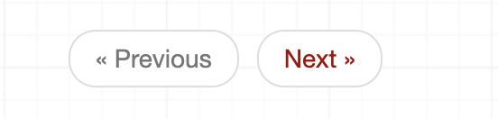

# Pagination-Filtering-Search-Ordering

# Pagination

- How have two options for pagination; you either set it globally or locally. For the original docs, see [here](https://www.django-rest-framework.org/api-guide/pagination/). For starters, you'll need to install djangorestframework

<aside>
💡 Doing the pagination on the back-end is recommended. Otherwise, if you prefer to do the pagination on the front-end, you'll probably end up having quite some load time when fetching the data.

</aside>

- For simplicity, we'll continue using the serializers and views we have used in [class-based-view](https://www.notion.so/Class-Based-Views-88b00551147541fb8c70a2f117405c3a) notes:

```python
# views.py
class StudentCRUD(ModelViewSet):
    queryset = Student.objects.all()
    serializer_class = StudentSerializer
```

### **[PageNumberPagination](https://www.django-rest-framework.org/api-guide/pagination/#pagenumberpagination)**

- Setting a global setting for PageNumberPagination:

```python
# settings.py
REST_FRAMEWORK = {
    'DEFAULT_PAGINATION_CLASS': 'rest_framework.pagination.PageNumberPagination',
    'PAGE_SIZE': 8
}

# this will get 10 objects per page for 25 pages in total since we have 200 objects
```

- But let's get that in comment and set a custom local configuration instead.
- First, let's create a new file named pagination.py to override some of the specs we want:

```python
# pagination.py
from rest_framework.pagination import PageNumberPagination # an import to be used for PageNumberPagination inheritence

class SmallPageNumberPagination(PageNumberPagination):
    page_size = 8 # we'll now see 8 objects per page

# page_size is only one of the configurations we can add, for other configurations see: 
# https://www.django-rest-framework.org/api-guide/pagination/#pagenumberpagination
# for instance, if you'd like to use the default 'page' endpoint as 'sayfa' you'd define a page_query_param = 'sayfa'
```

- Next up, we'll need to add the following to our views:

```python
# views.py
from .pagination import SmallPageNumberPagination

class StudentCRUD(ModelViewSet):
    queryset = Student.objects.all()
    serializer_class = StudentSerializer
    pagination_class = SmallPageNumberPagination 

# pagination_class is a reserved word for modiying our pagination style. Also, remember if we were to use it globally we'd write 
# 'DEFAULT_PAGINATION_CLASS' as a key and let 'rest_framework.pagination.PageNumberPagination' handle it by default based on
# the 'PAGE_SIZE' key-value pair.
```

- The response JSON will look like this:

```python
{
    "count": 200,
    "next": "http://127.0.0.1:8000/api/student/?page=2",
    "previous": null,
    "results": [
       {
            "id": 1,
            "path": "FullStack",
            "path_id": 1,
            "first_name": "Sarah",
            "last_name": "Lang",
            "number": 5234
        },
				...
    ]
}

# So, count comes by default. next and previous keys also come with the links (becuase we're on the first page, previous is null). And the 
# our actual data comes in the results' value part, here we'll have 8 objects per page bacause that's what we set it to
```

### **[LimitOffsetPagination](https://www.django-rest-framework.org/api-guide/pagination/#limitoffsetpagination)**

- Normally, PageNumberPagination is preferred to be used on the market, there's also LimitOffsetPagination, which gives detailed pagination with an offset value. The `limit` here indicates the maximum number of items to return, and is equivalent to the `page_size` in other styles. The `offset` indicates the starting position of the query in relation to the complete set of unpaginated items. Setting it globally looks like this:

```python
# settings.py
REST_FRAMEWORK = {
    'DEFAULT_PAGINATION_CLASS': 'rest_framework.pagination.LimitOffsetPagination'
}

# see more here: https://www.django-rest-framework.org/api-guide/pagination/#limitoffsetpagination
```

- Also, remove the 'pagination_class = SmallPageNumberPagination' line from your views.py because that was related to PageNumberPagination. Now you'll that you get all the 200 objects on one page. Well, not until you play around with the endpoint. For reference adding ? to your endpoint means a GET request. Thus, add `?limit=10` to your endpoint and you'll now be presented with 10 objects per page for 20 pages. This is just the limit part, which we were getting using the PageNumberPagination already. So, making use of the offset spec LimitOffsetPagination has, use the endpoint, say, `?limit=10&offset=11`. This will set 10 objects per page and ignore the first 11 objects, and will start from the 12th object. Therefore, we'll get:

```python
{
    "count": 200,
    "next": "http://127.0.0.1:8000/api/student/?page=2",
    "previous": null,
    "results": [
       {
            "id": 12,
            "path": "FullStack",
            "path_id": 1,
            "first_name": "Denise",
            "last_name": "Hernandez",
            "number": 7920
        },
				...
    ]
}

# like mentioned above, the endpoint .../?limit=10&offset=11 will give 10 (limit) objects per 
# page and start from 12, ignoring the first 11 (offset)
```

- Setting a local, rather than a global configuration(comment your settings.py part before doing this):

```python
# pagination.py
from rest_framework.pagination import LimitOffsetPagination # an import to be used for LimitOffsetPagination inheritence

class MyLimitOffsetPagination(LimitOffsetPagination):
    default_limit = 12
    limit_query_param = 'adet' # changing the default 'limit' query keyword to 'adet'

# default_limit = A numeric value indicating the limit to use if one is not provided by the client in a query parameter.
# with default_limit set to 12, we'll get 12 objects per page
```

- Now let's add the pagination_class to out views.py:

```python
# views.py
from .pagination import MyLimitOffsetPagination

class StudentCRUD(ModelViewSet):
    queryset = Student.objects.all()
    serializer_class = StudentSerializer
    pagination_class = MyLimitOffsetPagination 

# notice how this was exactly what we did setting PageNumberPagination locally. Therefore, whatever method you use, you import it to
# your views.py and set pagination_class with it
```

### **[CursorPagination](https://www.django-rest-framework.org/api-guide/pagination/#cursorpagination)**

- Instead of referring to specific pages by number, CursorPagination the queryset a cursor based on its *ordering* values.
- Setting up a global configuration for CursorPagination looks like this:

```python
REST_FRAMEWORK = {
    'DEFAULT_PAGINATION_CLASS': 'rest_framework.pagination.CursorPagination',
    'PAGE_SIZE': 3
}
```

- But for this global setting to work, we'd need a "created" field in our model. That's why setting this globally without a "created" field in our model would give a `Cannot resolve keyword 'created' into field.` error. Therefore, let's skip setting it globally for now and set it locally instead where we do not need to change our models.py:

```python
# pagination.py
from rest_framework.pagination import CursorPagination

class MycursorPagination(CursorPagination):
    page_size = 12 # we'll be seeing 12 pages on every page
    ordering = "-id" # the ordering, therefore, would be based on the id numbers decreasing. It'll start from id number 200 for our case
```


<p align="center">
  
</p>

- You may have noticed that, because this is cursor based, we do not see other pages. Rather, we are presented with Previous and Next buttons only.
- Now our url has gotten a random endpoint. That might be beneficial for security reasons. Also, unlike offset-based pagination, Cursor based pagination schemes support usage with very large datasets. And, lastly, When used properly `CursorPagination` ensures that the client will never see the same item twice when paging through records, even when new items are being inserted by other clients during the pagination process.

# Filtering

- The simplest way to filter the queryset of any view that subclasses `GenericAPIView` is to override the `get_queryset()` method. Let's see an example where we can filter with path name:

```python
class StudentCRUD(ModelViewSet):
    queryset = Student.objects.all()
    serializer_class = StudentSerializer
    pagination_class = MycursorPagination

    def get_queryset(self):
        queryset = Student.objects.all()
        path = self.request.query_params.get('path')
        if path is not None:
            mypath = Path.objects.get(path_name = path)
            queryset = queryset.filter(path = mypath.id)
        return queryset

# So now if I were to add ?path=CyberSec to my url endpoint it'd bring all the objects from CyberSec path
```

- `Generic Filtering`: As well as being able to override the default `get_queryset()`, REST framework also includes support for generic filtering backends that allow you to easily construct complex searches and filters. To make use of this, let's first install the following:

```python
pip install django-filter
```

- Then add `'django_filters'` to Django's `INSTALLED_APPS`:

```python
# settings.py
INSTALLED_APPS = [
    ...
    'django_filters',
    ...
]
```

- Setting it *globally* looks like this:

```python
# settings.py
REST_FRAMEWORK = {
    'DEFAULT_FILTER_BACKENDS': ['django_filters.rest_framework.DjangoFilterBackend']
}

# then add the following to your views.py:

class StudentCRUD(ModelViewSet):
    queryset = Student.objects.all()
    serializer_class = StudentSerializer
    pagination_class = MycursorPagination
		filterset_fields = ['first_name', 'last_name'] # therefore, you either override get_queryset method like we did above or add this line after installing django-filter and adding it to settings.py

# now this endpoint will let you filter based on first_name and last_name. Add /?last_name=Taylor to your endpoint and you'll get those with last_name Taylor
```

- Setting it *locally* requires you to add the `filter_backends` variable. As such:

```python
# views.py
from django_filters.rest_framework import DjangoFilterBackend # this is our local setting import for filtering

class StudentCRUD(ModelViewSet):
    queryset = Student.objects.all()
    serializer_class = StudentSerializer
    pagination_class = MycursorPagination
		filter_backends = [DjangoFilterBackend] # this line makes our filtering set locally instead of globally
		filterset_fields = ['first_name', 'last_name'] # as was the case in global settings, we are now able to filter based on first_name and last_name
```

# Search

- The difference between filter and search is that filter looks for the exact match, like, 'Sarah', while search would bring the object Sarah even when only searched for 'r'
- The `SearchFilter` class supports simple single query parameter based searching, and is based on the [Django admin's search functionality](https://docs.djangoproject.com/en/stable/ref/contrib/admin/#django.contrib.admin.ModelAdmin.search_fields). This one's syntax resemble that of filtering, only the attribute we define changes for the search names:

```python
# views.py
from rest_framework.filters import SearchFilter # this is our local setting import for search filtering

class StudentCRUD(ModelViewSet):
    queryset = Student.objects.all()
    serializer_class = StudentSerializer
    pagination_class = MycursorPagination
		filter_backends = [SearchFilter] # this line makes our filtering set locally instead of globally. 
    search_fields = ['first_name', 'last_name'] # this one searches based on the fields we pass to the list

# notice how we used 'filter_backends' for filtering and searching. Therefore, we could have passed both the DjangoFilterBackend and SearchFilter to the list and utilize both functionality
```

- Setting search filter globally is something like this:

```python
# settings.py
REST_FRAMEWORK = {
    'DEFAULT_FILTER_BACKENDS': ['rest_framework.filters.SearchFilter']
}

# do not forget to add the search_fields in your views.py regardless
search_fields = ['first_name', 'last_name']
```

# Ordering

- The OrderingFilter class supports simple query parameter controlled ordering of results.

```python
# views.py
from rest_framework.filters import OrderingFilter

class StudentCRUD(ModelViewSet):
    queryset = Student.objects.all()
    serializer_class = StudentSerializer
    pagination_class = MycursorPagination
		filter_backends = [OrderingFilter]
		ordering_fields = ['first_name', 'last_name']

# now we're able to order in four options; descending first or last name or ascending first or last name. The endpoints would look like this: ?ordering=-first_name
```

- If we want to order by a default value, say id, we'd then add a `order_by()` method to the queryset chain:

```python
# views.py
from rest_framework.filters import OrderingFilter

class StudentCRUD(ModelViewSet):
    queryset = Student.objects.all().order_by('-id')
    serializer_class = StudentSerializer
    pagination_class = SmallPageNumberPagination
		filter_backends = [OrderingFilter]
		ordering_fields = ['first_name', 'last_name']

# now, if not provided with a ordering preference our objects will be ordered by descending id order by default
```

- Filtering, Searching, Ordering all in one view:

```python
# views.py
from .pagination import SmallPageNumberPagination
from django_filters.rest_framework import DjangoFilterBackend
from rest_framework.filters import SearchFilter, OrderingFilter

class StudentCRUD(ModelViewSet):
    queryset = Student.objects.all().order_by('-id')
    serializer_class = StudentSerializer
    pagination_class = SmallPageNumberPagination
		filter_backends = [DjangoFilterBackend, SearchFilter, OrderingFilter]
    filterset_fields = ['first_name', 'last_name', 'number']
    search_fields = ['first_name', 'last_name']
    ordering_fields = ['first_name', 'last_name']
```